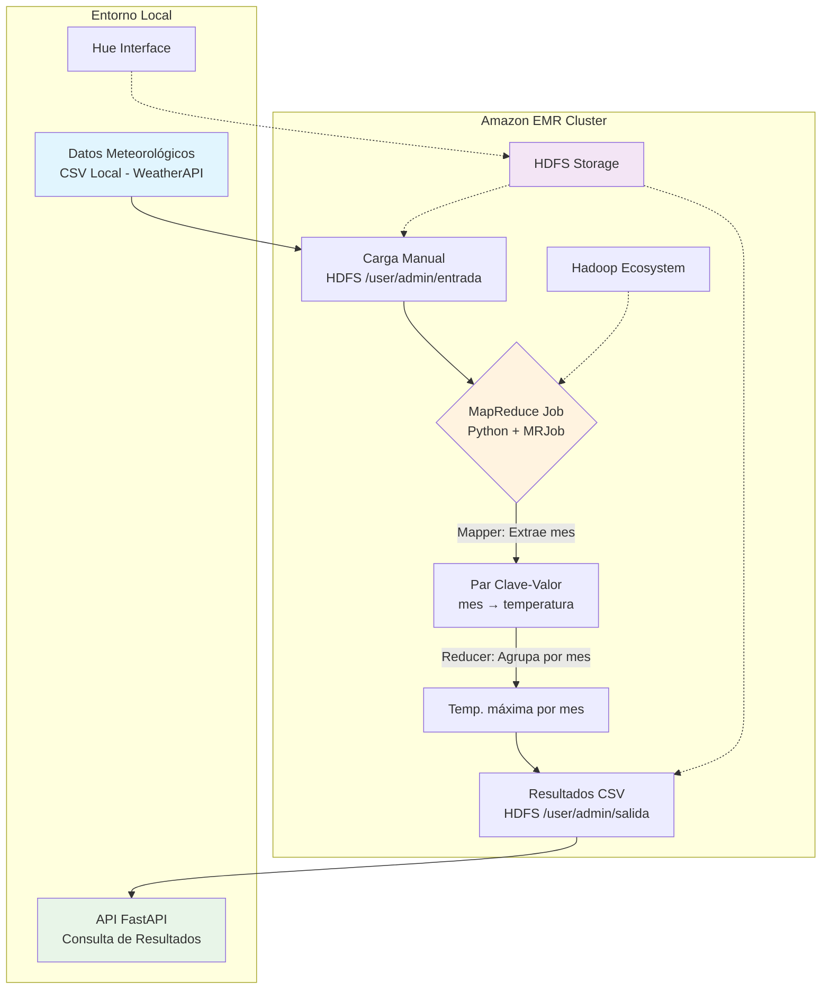

# Proyecto Final T.E.Telemática 

[](https://python.org)
[](https://hadoop.apache.org)
[](https://fastapi.tiangolo.com)
[](https://www.weatherapi.com/)

Este proyecto implementa un flujo completo de procesamiento de datos meteorológicos usando **Hadoop** y **MapReduce**, desplegado en Amazon EMR. Incluye la carga de datos a HDFS, su análisis mediante MapReduce en Python (con `mrjob`), y la visualización de resultados a través de una API desarrollada en **FastAPI**.

---

## Objetivo

Analizar las temperaturas mensuales en Medellín durante el año 2024, encontrando la **temperatura máxima promedio por mes**, usando procesamiento distribuido con Hadoop MapReduce.

---

## Arquitectura del Proyecto



### Flujo de Procesamiento MapReduce

1. **Mapper**: Extrae el mes desde la fecha, emitiendo pares clave-valor (mes, temperatura)
2. **Reducer**: Recibe temperaturas agrupadas por mes y calcula la temperatura máxima correspondiente

---

## Estructura del Repositorio

```
clima-hadoop/
├── datos/
│   ├── entrada/                # CSV original con datos del clima
│   └── salida/                 # CSV de salida generado por MapReduce
├── mapReduce/
│   ├── max_temp_mes.py        # Script MapReduce con mrjob
│   └── run_job.py             # Ejecuta el job y guarda CSV
├── api/
│   └── main.py                # API FastAPI para consultar resultados
├── requirements.txt           # Librerías necesarias
└── README.md                  # Este archivo
```

---

## Datos Utilizados

Se usaron datos simulados del clima de Medellín para el año 2024, obtenidos de la API [WeatherAPI](https://www.weatherapi.com/) y estructurados en un archivo CSV con las siguientes columnas:

### Estructura de Datos

| Campo | Tipo | Descripción |
|-------|------|-------------|
| `fecha` | Date | Fecha en formato `YYYY-MM-DD` |
| `temperatura_max` | Float | Temperatura máxima registrada ese día (°C) |
| `temperatura_min` | Float | Temperatura mínima registrada ese día (°C) |
| `precipitacion_mm` | Float | Precipitación medida en milímetros |
| `condicion` | String | Descripción generalizada del clima |

### Datos de Salida
- **Archivo**: `max_temp_mes.csv`
- **Contenido**: Temperatura máxima por mes del año 2024
- **Formato**: Mes y temperatura máxima correspondiente

---

## Ejecución del Job MapReduce

### 1. Instalación de Dependencias

Instalar las dependencias necesarias desde el entorno virtual:

```bash
pip install -r requirements.txt
```

### 2. Ejecutar el Procesamiento

```bash
cd mapReduce
python run_job.py
```

### Proceso Interno MapReduce

#### Función Mapper
- Extrae el **mes** desde la fecha
- Emite un par **clave-valor** con el mes como clave y la temperatura como valor

#### Función Reducer  
- Recibe todos los valores de temperatura **agrupados por mes**
- Obtiene la **temperatura máxima** correspondiente a cada mes

### 3. Resultado

El resultado es guardado en `datos/salida/max_temp_mes.csv`.

> **Nota**: Para fines de este proyecto, el resultado fue cargado manualmente a HDFS.

---

## Subida a HDFS

Desde Hue o consola Hadoop:

```bash
# Crear directorios si no existen
hdfs dfs -mkdir -p /user/admin/entrada
hdfs dfs -mkdir -p /user/admin/salida

# Subir archivo de resultados
hdfs dfs -put datos/salida/max_temp_mes.csv /user/admin/salida/
```

### Verificación en Hue
La carga exitosa se puede verificar navegando a través de la interfaz Hue del cluster EMR.

---

## Ejecutar la API

```bash
cd api
uvicorn main:app --reload
```

### Endpoints Disponibles

Una vez ejecutada la API, accede a:

- **Base URL**: `http://localhost:8000` - Ver endpoints disponibles
- **Documentación**: `http://localhost:8000/docs` - Interfaz Swagger interactiva
- **URL de datos**: `htto://localhost:8000/temperaturas-maximas` - Endpoint con resultados

---

## Video de Sustentación

En el video se explica:

- **Origen de datos**: Datos usados y su procedencia desde WeatherAPI
- **Proceso ETL**: Carga al sistema HDFS
- **MapReduce**: Funcionamiento del script Python usando `mrjob`
- **Resultados**: Análisis de temperaturas máximas obtenidas por mes
- **API Demo**: Consulta de resultados mediante endpoints

**[Ver Video de Sustentación](https://www.canva.com/design/DAGpGF2MLng/rt8eDs0YAKpPxP_qSrtE6A/edit?utm_content=DAGpGF2MLng&utm_campaign=designshare&utm_medium=link2&utm_source=sharebutton)**

---

## Tecnologías Utilizadas

### Infraestructura y Big Data
- **Hadoop** (Amazon EMR) - Framework de procesamiento distribuido
- **HDFS** - Sistema de archivos distribuido de Hadoop

### Desarrollo y Procesamiento  
- **Python** + **MRJob** - Implementación de MapReduce
- **FastAPI** - Framework web moderno para la API

### Herramientas
- **Hue** - Interfaz web para interactuar con Hadoop
- **Git** + **GitHub** - Control de versiones y repositorio

### Fuente de Datos
- **[WeatherAPI](https://www.weatherapi.com/)** - API meteorológica para obtener datos de Medellín

---

## Resultados del Proyecto

Este proyecto demuestra exitosamente:

- **Procesamiento Distribuido**: Uso efectivo de Hadoop MapReduce
- **Integración Cloud**: Despliegue en Amazon EMR
- **Pipeline Completo**: Desde ingesta hasta API de consulta
- **Análisis Temporal**: Identificación de patrones mensuales de temperatura
- **Arquitectura Escalable**: Diseño preparado para grandes volúmenes de datos

---

## Autora

**Paulina Cerón Mancipe**
- **Proyecto final** - Procesamiento Distribuido
- **Junio 2025**
- **Tópicos Especiales de Telemática**
